# Basic Grasshopper Functionality

For the first real definition we cover, we are going to make a widget to put into practice what was covered in the previous interface section. Moreso, this widget will demonstrate in a toy manner, some of the major uses of Grasshopper. See [this link](https://github.com/aarcThom/aarc-wiki/blob/main/gh_definitions/01_basic_definition.gh) for the file.

We will cover this and future definitions, step by step. Refer to the numbered component groups in the image below.

<figure markdown>
  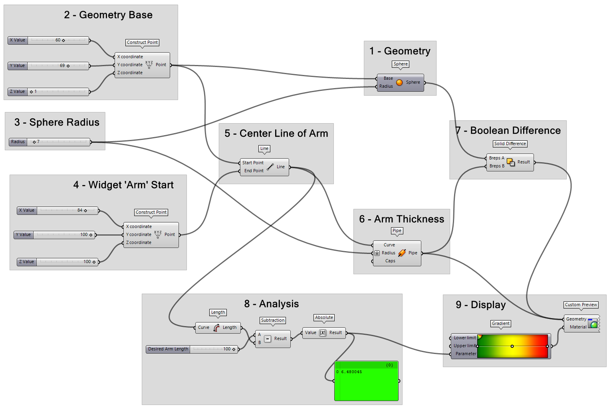{ width="850" }
  <figcaption>How to make a Widget Using Grasshopper</figcaption>
</figure>

## 01 - How a Geometry Component Works

### 01A - Parallels with a Rhino Command
A single component in Grasshopper often roughly corresponds to a command in Rhino. 
For example, run the Rhino command `Sphere`. You will be taken through a 2 step process via the Rhino command line.

1.  Rhino will first prompt you for the center of the sphere which you can provide either with your cursor or with coordinates through the command line.
2.  Rhino will prompt you for a radius which you can provide in one of the two ways above.

<figure markdown>
  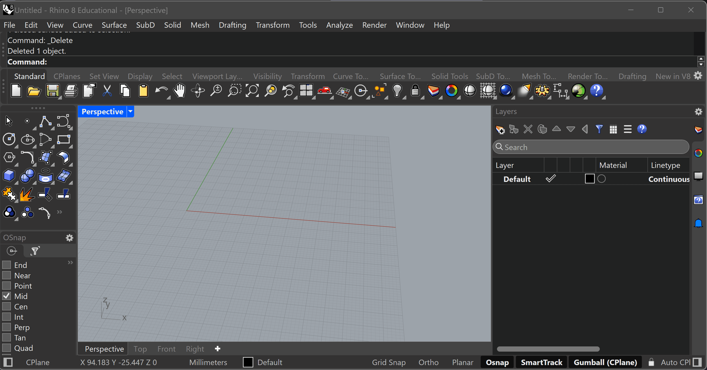{ width="850" }
</figure>

Grasshopper provides an analogous component, also named `Sphere`. To use it, open Grasshopper, click the *Surface* tab, then the *Primitive* dropdown menu, and select `Sphere`.

<figure markdown>
  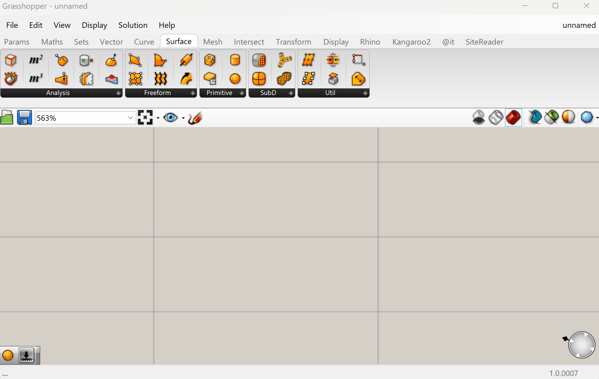{ width="850" }
</figure>

Take a look at the component on the canvas. Remembering that Grasshopper flows from left to right, we can intuit that we have 2 inputs: **Base** and **Radius**. Our single output, **Sphere** is the geometry itself. *This Grasshopper component requires the same inputs to create the same output as the corresponding Rhino command.*

<figure markdown>
  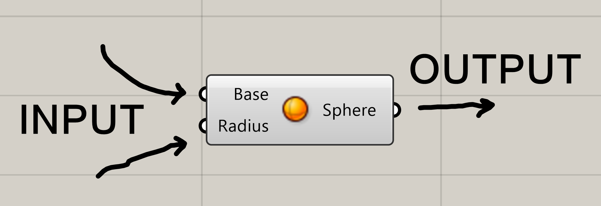{ width="850" }
</figure>

This is fundamentally how Grasshopper works. We use components as flexible and non-destructive (parametric) stand-ins for commands we traditionally run through Rhino. In other words, once you've created that sphere in Rhino, you can't modify its properties without resorting to other additional commands such as `scale3D`, ++ctrl+z++, etc. With Grasshopper, we can tweak the inputs to the sphere all day long!

### 01B - How Component Geometry is Represented Visually

#### Viewport Representation
Grasshopper geometry is represented much differently that Rhino geometry. To see this, zoom in towards the origin of your Rhino viewport. You'll see a translucent red sphere. Click the `Sphere` component, and the translucent sphere will turn green. This little ghostly sphere corresponds to the `Sphere` component.

<figure markdown>
  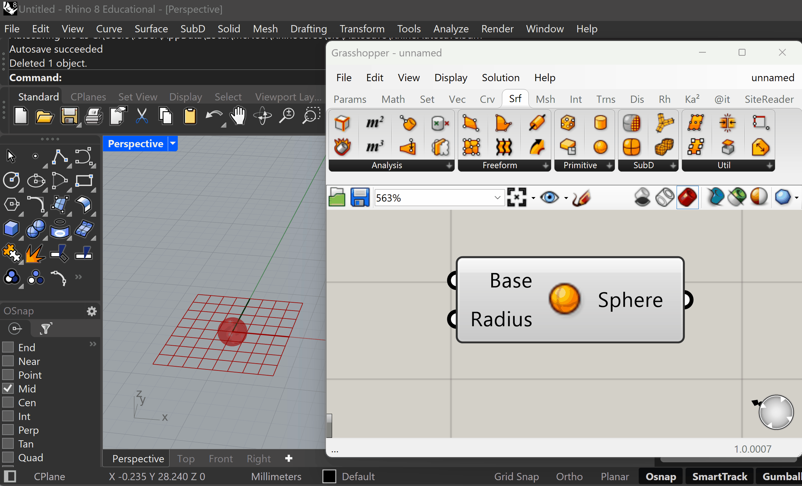{ width="850" }
</figure>

!!! Tip "Grasshopper geometry is a representation of geometry within a component"
    If a Grasshopper component creates, alters, or reorganizes geometry, there will be a corresponding representation in the Rhino viewport. This representation will be green if the component is selected in the GH canvas and red if the component is not selected in the canvas.

Now, if you try clicking on the Grasshopper sphere in Rhino, what happens? Nothing! You cannot interact with the Grasshopper geometry directly in Rhino in this way. Think back to that one undergrad philosophy course you took, and recall a allegory about a cave (but don't recall it too well!) Rhino representations of Grasshopper geometry are just that, *representations* of specific points in your parametric modeling process.

<figure markdown>
  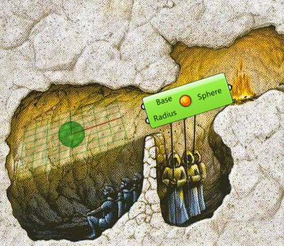
  <figcaption>This is EXACTLY how Grasshopper works under the hood</figcaption>
</figure>

To illustrate the point that Rhino previews of Grasshopper geometry are representations, try placing a `Move` component onto the canvas, and hooking the output of `Sphere` into the `Geometry` input. You will see that both the original `Sphere` geometry and the new sphere, output from `Move` are present in the viewport. 

<figure markdown>
  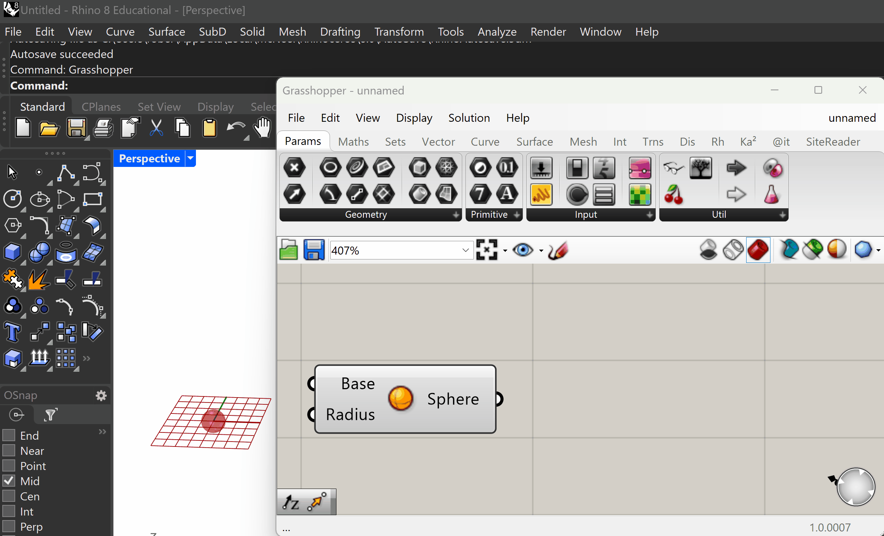{ width="850" }
</figure>

Both spheres present in the viewport are representations of specific steps of the modeling process. This hilights another important point:

!!! Tip "Grasshopper components are non-destructive"
    A grasshopper component does not erase the geometry or information contained in the previous step. Every step of the parametric modeling process is retained.

We will get into ways we can interact with Grasshopper through the Rhino viewport, when we talk about *referencing geometry*, but in general, the primary way that we interact with Grasshopper geometry is through the Grasshopper canvas.

#### Preview
Since the geometry we see in the Rhino viewport is a *representation*, we are able to turn on and off its visibility without effecting the geometry actually contained within the component. Try ++"rmb"++ `Sphere` and toggling *preview*.

<figure markdown>
  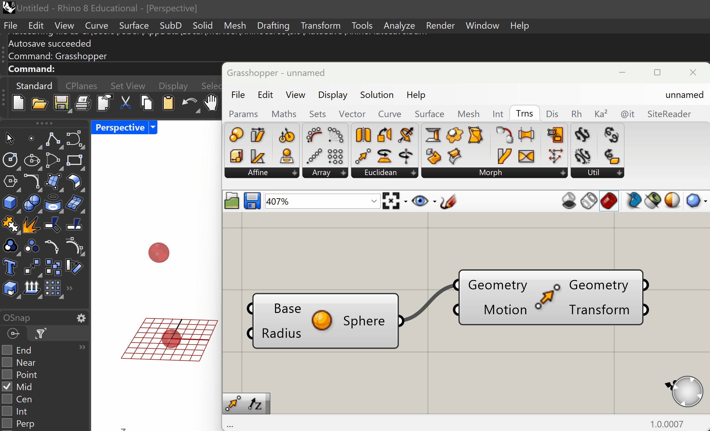{ width="850" }
</figure>

When we toggle *preview* we are toggling whether or not the geometry representation is visible in Rhino. *Turning off preview does not alter the underlying Grasshopper geometry or affect the following components.*

Also note that when a component's preview is turned off, the component itself becomes a slightly darker shade of grey.

<figure markdown>
  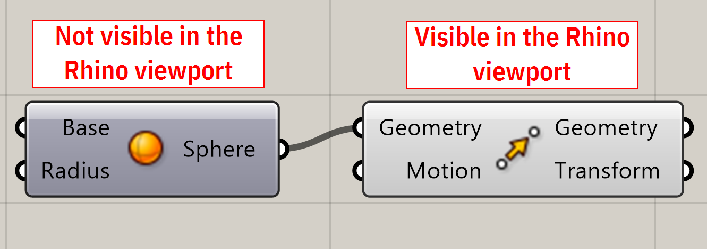{ width="850" }
</figure>

#### Enable

When we toggle *enable* we are toggling both the Rhino preview and the actual Grasshopper component. You can see that both spheres dissapear since `Move` doesn't have the original sphere flowing into it. *Disabling a component disables the underlying geometry and makes the component's information unavailable to downstream components.*

<figure markdown>
  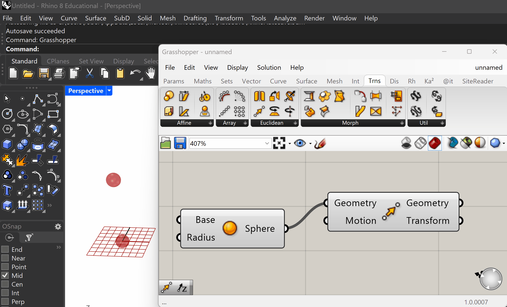{ width="850" }
</figure>

When a component is disabled, it takes on a more muted gray scheme. The orange wire also indicates that no data is flowing from the disabled component's output.

<figure markdown>
  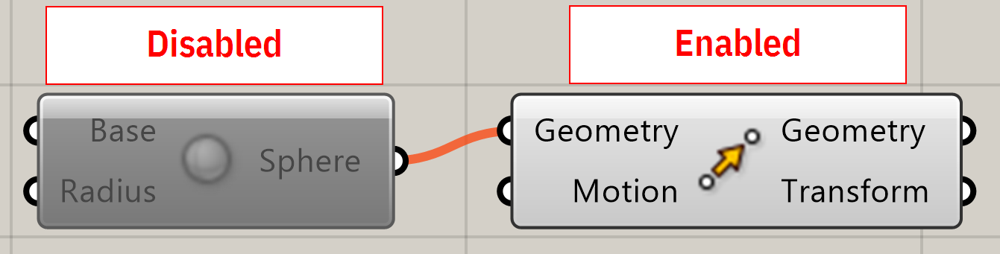{ width="850" }
</figure>

#### Delete

Finally, deleting a component from the canvas, will wipe its corresponding representation from the viewport, and make the now-deleted information unavailable to all downstream components. I'm deleting the `Sphere` in the .gif below, but try deleting the `Move` component to follow along with the next steps. You just ++"lmb"++ `Move` and hit ++delete++.

<figure markdown>
  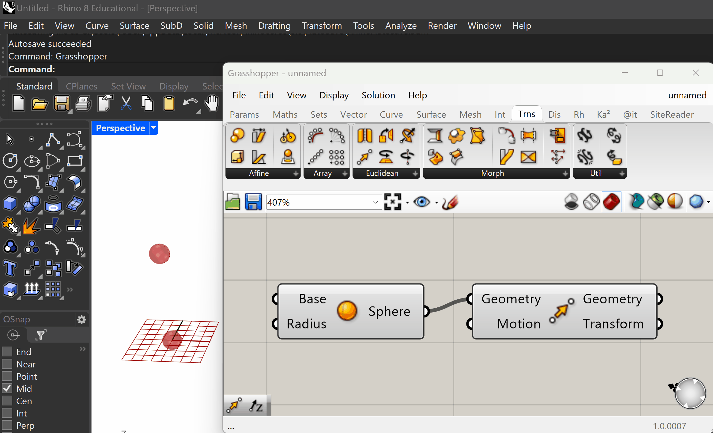{ width="850" }
</figure>

### 01C - How Component Information is Represented Textually

While textual representations of geometry may seem overkill at this point, the textual representations of component data are often more useful than visual representations in the viewport. This will become more apparent when we start considering the organization of data within a definition, but even at this point, we can use these menus to learn the inputs and outputs of a specific component. Hover over the inputs, outputs, and icon of `Sphere`.

<figure markdown>
  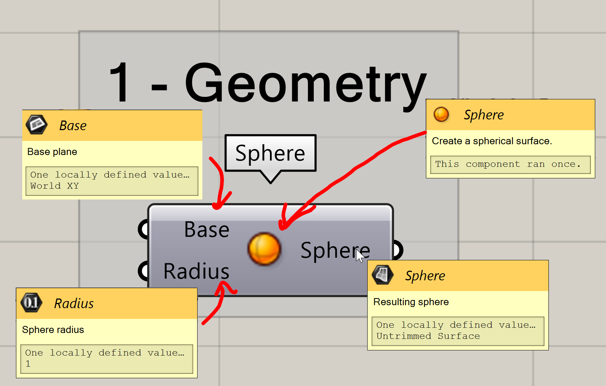{ width="850" }
</figure>

!!! Tip "Hover over everything"
    In the input and output boxes shown above, we are shown three important pieces of data. Going from top to bottom:

    1. The name of the input or output.
    2. A description of what sort of data can be passed through the input or output.
    3. A description of the data currently flowing through an input or output.

### 01D - Baking
We've covered how the representations of Grasshopper geometry are not Rhino geometry. But how do we then bring our GH work into Rhino so we can finish our project? We bake it! **Baking refers to converting Grasshopper geometry to Rhino geometry.**

<figure markdown>
  
  <figcaption>The joys of baking</figcaption>
</figure>

To bring geometry from Grasshopper into Rhino at any step of your definition, ++"rmb"++ the component you want to *bake* and select 🍳**Bake**.

This will bring up the generically titled *Attributes* window. Here, you can select which layer you want to *bake* your selected Grasshopper geometry to. You can also choose to group the geometry or set some display options.

<figure markdown>
  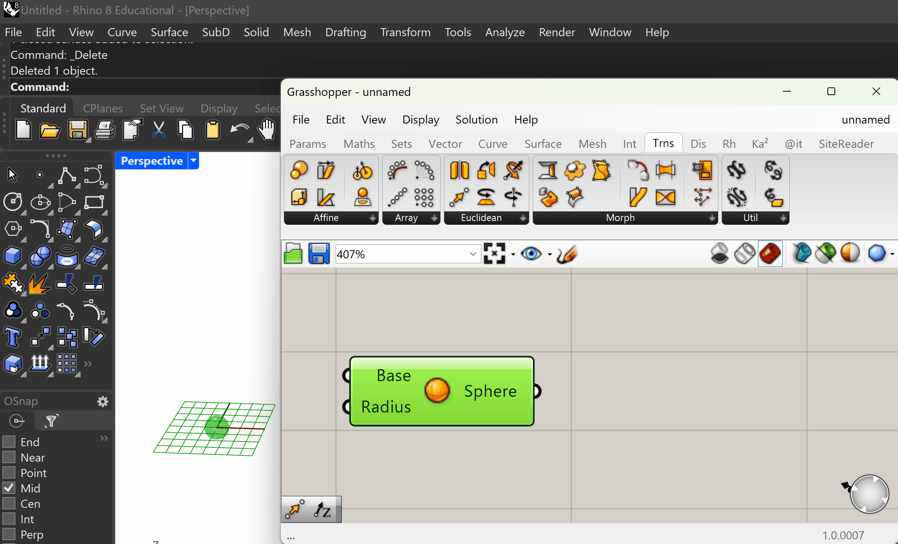{ width="850" }
</figure>

You have now created a Rhino object from the component you baked that you can interact with in Rhino. Note, that this Rhino object that you have just baked exists totally independently of all your Grasshopper geometry. You can delete or transform it without any side effects in the Grasshopper canvas.

## 02 / 03 - Setting Parameters

*Parameters* in the context of Grasshopper refer to 2 things:

1.  Parameters are the *variables* of a Grasshopper definition. Think back to high school math - the function $y=sin(x)$ has a *parameter or        variable* $x$. As $x$ changes, the output $y$ also changes. In this analogy, $y$ is the geometry we will utlimately bake into Rhino, $sin()$ is our Grasshopper definition, and $x$ are our input parameters. However, in Grasshopper, instead of just numbers, we are able to pass geometry, text, user interaction and all sorts of things in as parameters.<figure markdown>
  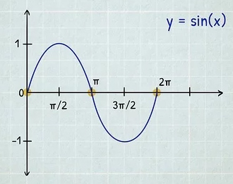
</figure>

2.  We also use the terms *parameter* to refer to the Grasshopper components which are used to pass in values. These special components are handily stored in the *parameters* tab. 
!!! Tip "Parameters & Components - What's the Difference"
    All the little 'nodes' that make up a Grasshopper definition (script) are called *components*. *Parameters* are a class of component that either reference data from Rhino, reference data from outside of Rhino / Grasshopper, or reference user input.

In this section of our definition, we are using 3 `Number Slider` *parameters* to define the X, Y, and Z values of a 3D point. To convert these values into the geometric point, we use `Construct Point`. 

We also use a `Number Slider` to define the **Radius** of the `Sphere`.

<figure markdown>
  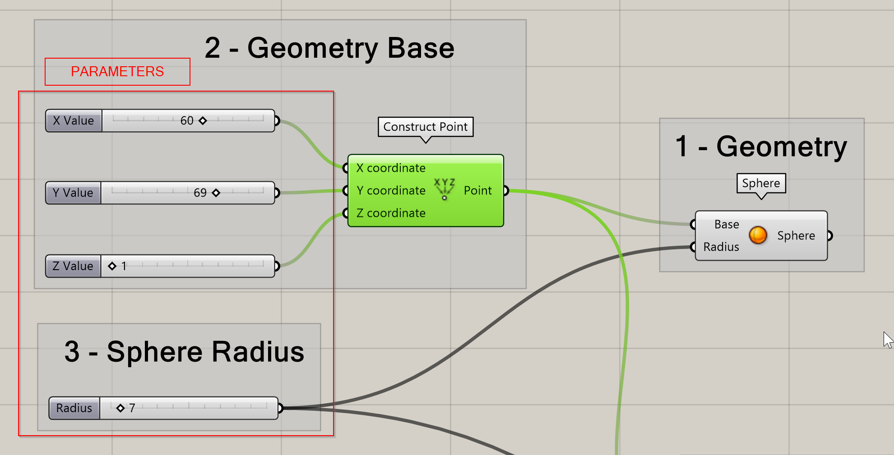{ width="850" }
</figure>

The output of `Construct Point` is plugged into the the **Base** input of the `Sphere` component.

!!! Warning "Grasshopper Type Conversions"
    Grasshopper often converts geometrical types that are *close enough* upon input. In this example, `Construct Point` outputs a 3D point which is plugged into **Base** in `Sphere` despite **Base** asking for a 3D plane. In cases like these Grasshopper will automatically convert a 3D point into a plane with an origin defined by that 3D point. Other conversions happen - try plugging the 'wrong' geometry into inputs to see what happens, but don't be surprised if you get an error sometimes!

## 04 / 05 - Drawing a Line
<figure markdown>
  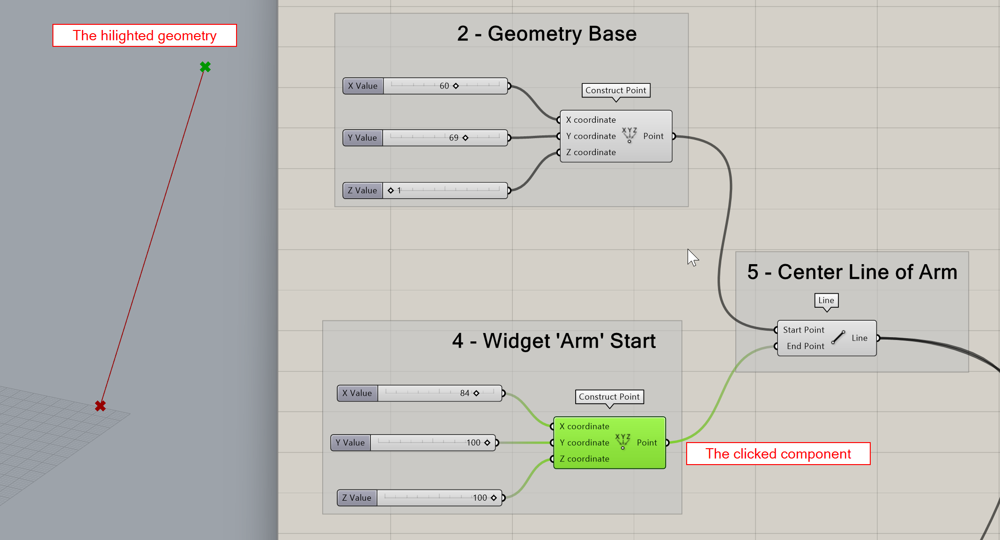{ width="850" }
</figure>

## 06 - The Input Expression Editor

Grasshopper offers a really useful way to quickly alter numerical values on component input. Let's say we want to ensure that our widget arm is always half a wide as the widget base. To do so, we can ++"rmb"++ the **Radius** of `Pipe`, select **Expression** and then write a short algebraic statement in the input box. In this case we can write *x / 2*. This will set our radius to always be half of the input value, and since our input `Number Slider` also controls the `Sphere`'s radius, the radius of our pipe will always be *the sphere radius / 2*.

!!! Warning "Always X!"
    The input Expression field can only ever contain one variable, X. If you need a more complex expression, you can always build it up outside of an input from components found in the *Maths* tab.

<figure markdown>
  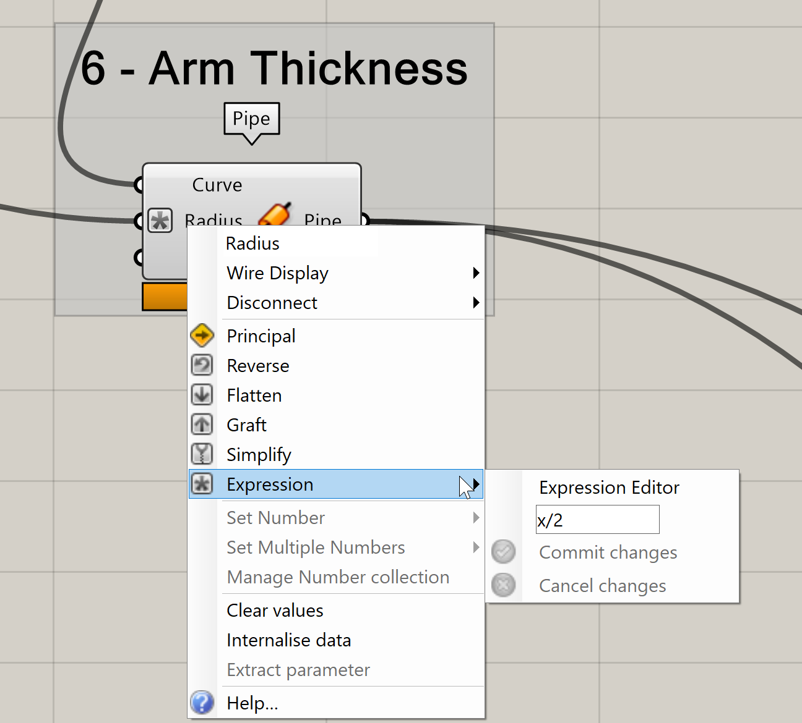{ width="850" }
</figure>

## 07 - Boolean Operations

## 08 - Geometry Analysis
Group 8 demonstrates how Grasshopper can be used for geometrical analysis, and how you can quickly build up algebraic functions. 

In this instance, our goal is to determine how far off our widget's arm length is from a user set desired length. We begin by measuring the length of the `Line` component with `Length`. We use a `Number Slider` to define the desired length. We subtract the actual length from the desired length using `Subtraction` to give us the signed difference. Since we don't care about whether the arm length is less than or greater than the desired length, we get rid of the sign using `Absolute`. Finally we use a `Panel` to get a text output of how far away we are from our goal.

<figure markdown>
  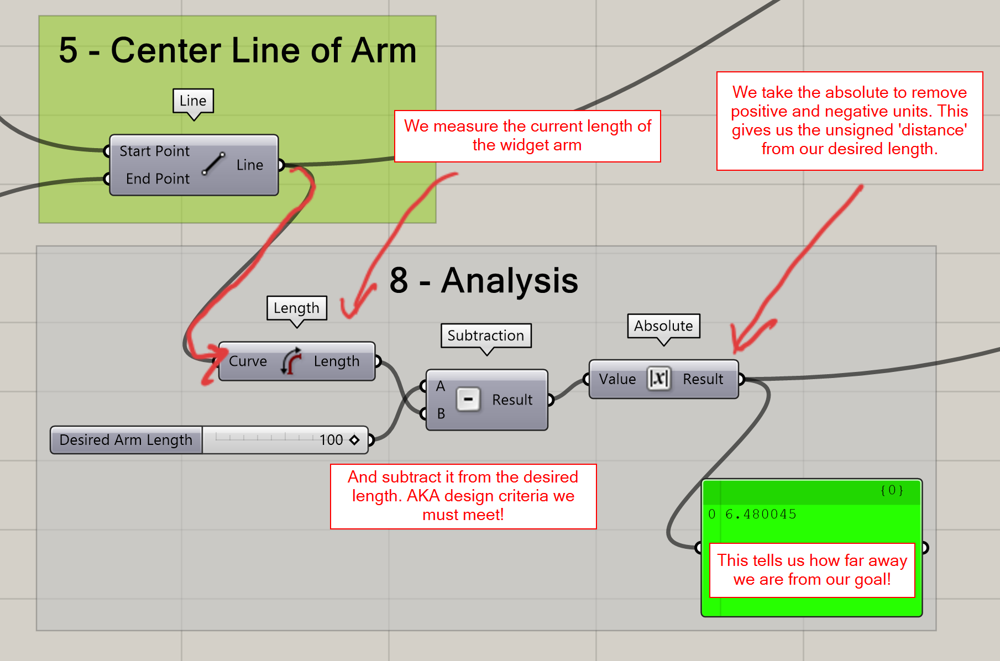{ width="850" }
</figure>

## 09 - Visualization
Often, visual feedback within the Rhino viewport is the most intuitive way to display conformance with design criteria. In this instance we will color our widget with `Custom Preview`. The color that feeds into the **Material** input is given by `Gradient`. If the widget is red, we are far from our goal, if it is green, we are close to or at our goal length.

Our output from `Absolute` is fed into `Display`'s **Parameter**. Here we are telling `Display` to return a color based on the position of `Absolute`'s output within the numerical range defined between **Lower Limit** and **Upper Limit**. By default, this range is *0 to 1*. 

We don't know how far from the goal we can get, but let's start with *100* for the **Upper Limit**.

!!! Tip "Setting a Parameter Value Internally"
    If you ++"rmb"++ on a given parameter and select *Set ...*, you will be able to internally set a static value.

<figure markdown>
  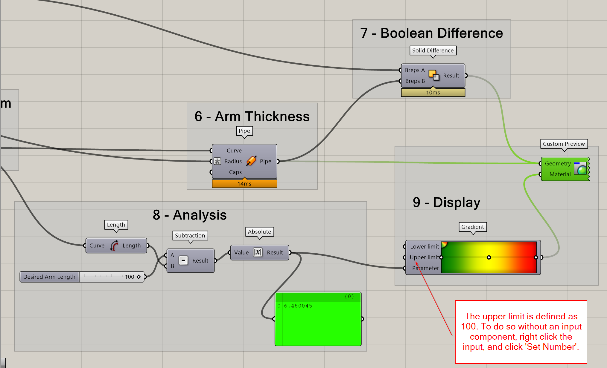{ width="850" }
</figure>

Now that we've set our upper limit to *100*, we will see our widget's color update as we move further and closer from our design goal!

<figure markdown>
  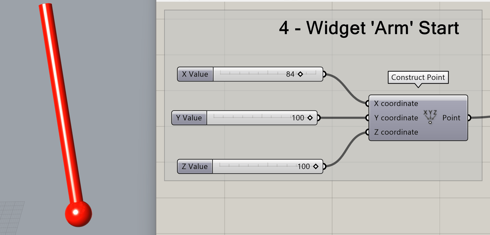{ width="850" }
</figure>

