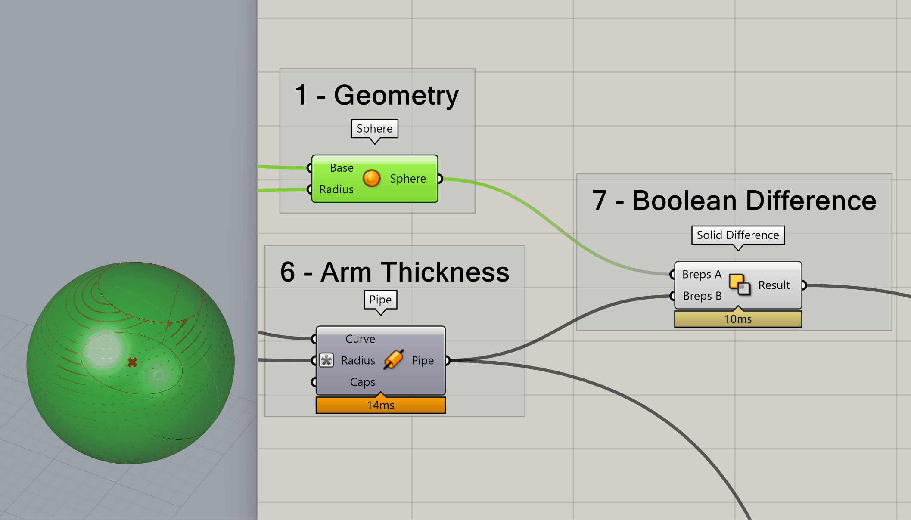

# Your First Grasshopper Definition

For the first real definition we cover, we are going to make a widget. This widget isn't totally purposeless - it demonstrates some of the core functionalities within Grasshopper. See [this link](https://github.com/aarcThom/aarc-wiki/blob/main/gh_definitions/01_basic_definition.gh) for the file.

We will cover this and future definitions, step by step. Refer to the numbered component groups in the image below.

<figure markdown>
  { width="850" }
  <figcaption>How to make a Widget Using Grasshopper</figcaption>
</figure>

## 01 - Geometry

We will start with geometry we can create within Grasshopper itself. To create a sphere using only Grasshopper, we can use `Sphere`. The key take away from examining this component with its default settings is that Grasshopper offers multiple methods of visualizing data contained within a component.

<figure markdown>
  { width="850" }
</figure>

!!! Tip "Hover over everything"
    In the input and output boxes shown above, we are shown three important pieces of data. Going from top to bottom:
    1. The name of the input or output.
    2. A description of what sort of data can be passed through the input or output.
    3. A description of the data currently flowing through an input or output.

Grasshopper also allows us to preview our geometry in the Rhino viewport. Grasshopper geometry, by default will appear red. When the corresponding component is selected, the geometry will appear green.

<figure markdown>
  { width="850" }
</figure>

!!! Warning "Grasshopper geometry doesn't exit in Rhino until baked!"
    Despite being able to view the geometry in the Rhino viewports, Grasshopper geometry exists in its own world until it is specifically brought into Rhino through baking.

## Baking
**Baking refers to converting Grasshopper geometry to Rhino geometry.**

To bring geometry from Grasshopper into Rhino at any step of your definition, ++"rmb"++ the component you want to *bake* and select 🍳**Bake**.

This will bring up the generically titled *Attributes* window. Here, you can select which layer you want to *bake* your selected Grasshopper geometry to. You can also choose to group the geometry or set some display options.

<figure markdown>
  { width="850" }
</figure>

## 02 / 03 - Setting Parameters

In this section of our definition, we are using 3 `Number Slider` *parameters* to define the X, Y, and Z values of a 3D point. To convert these values into the geometric point, we use `Construct Point`. 

We also use a `Number Slider` to define the **Radius** of the `Sphere`.

<figure markdown>
  { width="850" }
</figure>

!!! Tip "Parameters & Components - What are they?"
    All the little 'nodes' that make up a Grasshopper definition (script) are called *components*. *Parameters* are a class of component that either reference data from Rhino, reference data from outside of Rhino / Grasshopper, or, as in this case, reference user input.

The output of `Construct Point` is plugged into the the **Base** input of the `Sphere` component.

!!! Warning "Grasshopper Type Conversions"
    Grasshopper often converts geometrical types that are *close enough* upon input. In this example, `Construct Point` outputs a 3D point which is plugged into **Base** in `Sphere` despite **Base** asking for a 3D plane. In cases like these Grasshopper will automatically convert a 3D point into a plane with an origin defined by that 3D point. Other conversions happen - try plugging the 'wrong' geometry into inputs to see what happens, but don't be surprised if you get an error sometimes!

## 04 / 05 - Drawing a Line and Visualizing Geometry

In addition to textual descriptions, we can of course, visualize geometry in the Rhino window. Be default, geometry that is visible *but not selected* will be displayed as red while geometry that *is selected* will be displayed a green.

In this case when we ++"lmb"++ the `Construct Point` in group 4, we see the corresponding point turn green in the Rhino viewport.

Group 5 shows the use of the `Line` component. This component defines a line from a start point and an end point - extremely useful.

<figure markdown>
  { width="850" }
</figure>

## 06 - The Input Expression Editor

Grasshopper offers a really useful way to quickly alter numerical values on component input. Let's say we want to ensure that our widget arm is always half a wide as the widget base. To do so, we can ++"rmb"++ the **Radius** of `Pipe`, select **Expression** and then write a short algebraic statement in the input box. In this case we can write *x / 2*. This will set our radius to always be half of the input value, and since our input `Number Slider` also controls the `Sphere`'s radius, the radius of our pipe will always be *the sphere radius / 2*.

!!! Warning "Always X!"
    The input Expression field can only ever contain one variable, X. If you need a more complex expression, you can always build it up outside of an input from components found in the *Maths* tab.

<figure markdown>
  { width="850" }
</figure>

## 07 - Previewing Geometry

Grasshopper is *non-destructive*. Geometry created during the process of building up a definition is never deleted. However, you will often want to hide intermediate geometry. To do so, ++"rmb"++ the component containing the geometry to be hidden, and ++"lmb"++ *Preview*. This will toggle on and off the geometry preview in the Rhino viewport without affecting the downstream Grasshopper components.

<figure markdown>
  { width="850" }
</figure>

!!! Warning "Enable is different than Preview"
    Enable disables both the preview in the Rhino viewport, *and disables the component preventing downstream components from accessing the contained data.* Try disabling the output of a component. You will see that you get errors downstream!

## 08 - Geometry Analysis
Group 8 demonstrates how Grasshopper can be used for geometrical analysis, and how you can quickly build up algebraic functions. 

In this instance, our goal is to determine how far off our widget's arm length is from a user set desired length. We begin by measuring the length of the `Line` component with `Length`. We use a `Number Slider` to define the desired length. We subtract the actual length from the desired length using `Subtraction` to give us the signed difference. Since we don't care about whether the arm length is less than or greater than the desired length, we get rid of the sign using `Absolute`. Finally we use a `Panel` to get a text output of how far away we are from our goal.

<figure markdown>
  { width="850" }
</figure>

## 09 - Visualization
Often, visual feedback within the Rhino viewport is the most intuitive way to display conformance with design criteria. In this instance we will color our widget with `Custom Preview`. The color that feeds into the **Material** input is given by `Gradient`. If the widget is red, we are far from our goal, if it is green, we are close to or at our goal length.

Our output from `Absolute` is fed into `Display`'s **Parameter**. Here we are telling `Display` to return a color based on the position of `Absolute`'s output within the numerical range defined between **Lower Limit** and **Upper Limit**. By default, this range is *0 to 1*. 

We don't know how far from the goal we can get, but let's start with *100* for the **Upper Limit**.

!!! Tip "Setting a Parameter Value Internally"
    If you ++"rmb"++ on a given parameter and select *Set ...*, you will be able to internally set a static value.

<figure markdown>
  { width="850" }
</figure>

Now that we've set our upper limit to *100*, we will see our widget's color update as we move further and closer from our design goal!

<figure markdown>
  { width="850" }
</figure>

