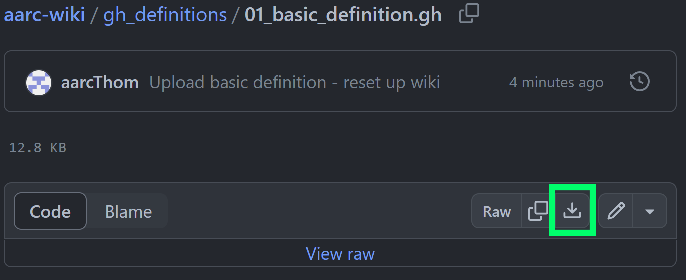
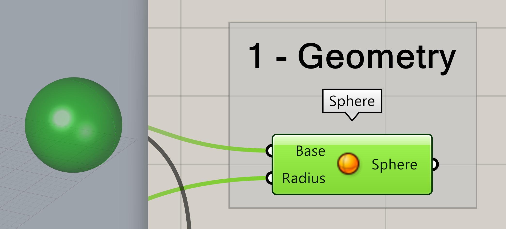
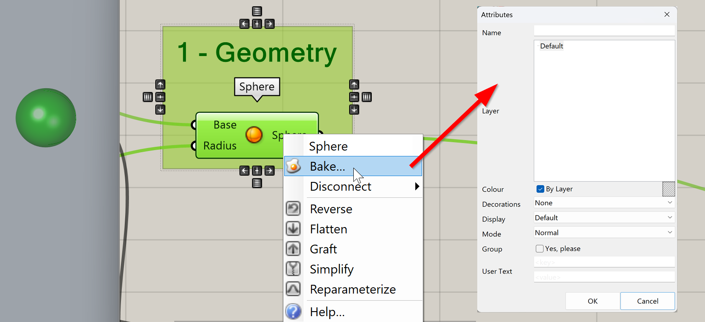

# Your First Grasshopper Definition

## File Downloads
All GH files will be available for download. Follow [the links](https://github.com/aarcThom/aarc-wiki/blob/main/gh_definitions/01_basic_definition.gh) provided with each page of instruction to download the proper file. Once you're on the linked page, click the *raw download* button as shown in a green rectangle below to download the `.gh` file.

<figure markdown>
  { width="850" }
  <figcaption>Click the button in the green rectangle!</figcaption>
</figure>

## Your First Grasshopper Definition
For the first real definition we cover, we are going to make a widget. This widget isn't totally purposeless - it demonstrates some of the core functionalities within Grasshopper.
 
We will cover this and future definitions, step by step. Refer to the numbered component groups in the image below.
 

<figure markdown>
  { width="850" }
  <figcaption>How to make a Widget Using Grasshopper</figcaption>
</figure>

## 01 - Geometry

We will start with geometry we can create within Grasshopper itself. To create a sphere using only Grasshopper, we can use `Sphere`. The key take away from examining this component with its default settings is that Grasshopper offers multiple methods of visualizing data contained within a component.

<figure markdown>
  { width="850" }
</figure>

!!! Tip "Hover over everything"
    In the input and output boxes shown above, we are shown three important pieces of data. Going from top to bottom:
    1. The name of the input or output.
    2. A description of what sort of data can be passed through the input or output.
    3. A description of the data currently flowing through an input or output.

In addition to textual descriptions, we can of course, visualize geometry in the Rhino window. Be default, geometry that is visible *but not selected* will be displayed as red while geometry that *is selected* will be displayed a green.

<figure markdown>
  { width="850" }
</figure>

!!! Warning "Grasshopper geometry doesn't exit in Rhino until baked!"
    Despite being able to view the geometry in the Rhino viewports, Grasshopper geometry exists in its own world until it is specifically brought into Rhino through baking.

## Baking
**Baking refers to converting Grasshopper geometry to Rhino geometry.**

To bring geometry from Grasshopper into Rhino at any step of your definition, right click the component you want to *bake* and select 🍳**Bake**.

This will bring up the generically titled *Attributes* window. Here, you can select which layer you want to *bake* your selected Grasshopper geometry to. You can also choose to group the geometry or set some display options.

<figure markdown>
  { width="850" }
</figure>

## 02 / 03 Setting Parameters

In this section of our definition, we are using 3 `Number Slider` *parameters* to define the X, Y, and Z values of a 3D point. To convert these values into the geometric point, we use `Construct Point`. 

We also use a `Number Slider` to define the radius of the `Sphere`.

!!! Tip "Parameters & Components - What are they?"
    All the little 'nodes' that make up a Grasshopper definition (script) are called *components*. *Parameters* are a class of component that either reference data from Rhino, reference data from outside of Rhino / Grasshopper, or, as in this case, reference user input.

The output of `Construct Point` is plugged into the the **base** input of the `Sphere` component.

!!! Tip "Grasshopper Type Conversions"
    Grasshopper often converts geometrical types that are *close enough* upon input. In this example, `Construct Point` outputs a 3D point which is plugged into **Base** in `Sphere` despite **Base** asking for a 3D plane. In cases like these Grasshopper will automatically convert a 3D point into a plane with an origin defined by that 3D point. Other conversions happen - try plugging the 'wrong' geometry into inputs to see what happens, but don't be surprised if you get an error sometimes!
