# Grasshopper Interface
First things, first. To open Grasshopper type  ```grasshopper``` into your Rhino command line, or simply click the 🦗 icon in the standard tab.

## A First Look
The window that pops up should look something like the image below. Note that your window may also be overlaid with the tutorials file window. You can safely close this window as those tutorials are also stored in the Grasshopper help tab.

The image below outlines the main areas of the user interface. Each of these areas are elaborated in the following sections. Click on the tabs below to scroll through descriptions of the sub-menus and functionalities of the Grasshopper UI.

!!! Warning "The Grasshopper component panels below may look slightly different"
    As you progress with Grasshopper, you will add custom component panels to your interface. All of the illustrations have two custom panels: *Wb (weaverbird)* and *Lunchbox*. Don't worry that your fresh copy of Grasshopper doesn't have these two panels!

<figure markdown>
  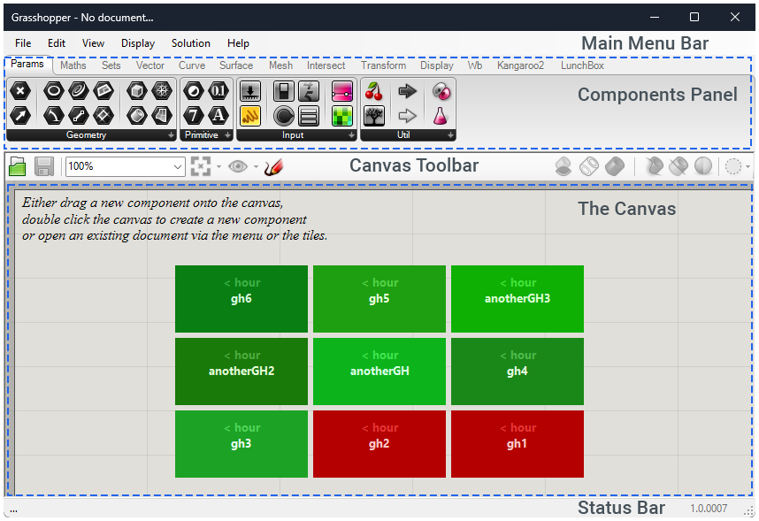{ width="850" }
  <figcaption>Grasshopper Interface</figcaption>
</figure>

## Main Menu Bar
=== "Intro"

    <figure markdown>
    { width="850" }
    </figure>

    The main menu bar is similar to other programs you have encountered using windows.

=== "File tab"

    <figure markdown>
    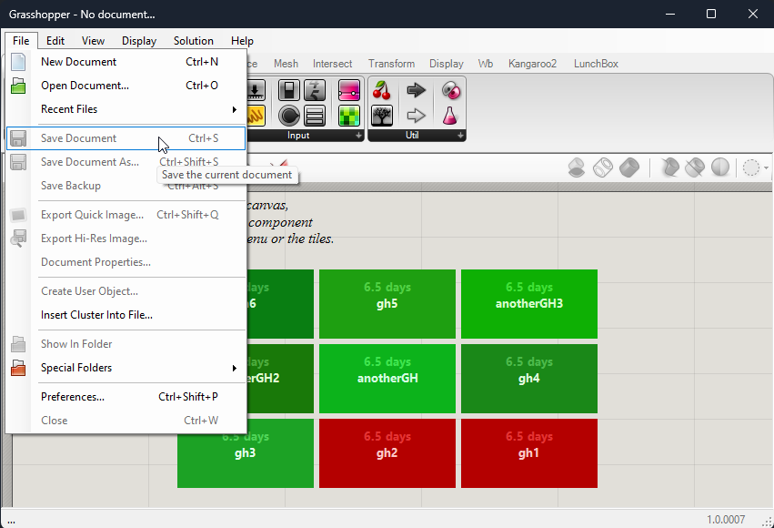{ width="850" }
    </figure>

    !!! Warning
        Grasshopper has a tendency to freeze and/or crash while you are learning how to use it. Save often using the ```Save``` command under the file tab, or press ++ctrl+s++.

    Open one of the tutorial files under ```Help --> Tutorial Files``` and try both the ```export quick image``` and ```Export Hi-Res Image``` commands. These can be useful for sharing your work with others. I wouldn't encourage you to include the diagrams on studio presentation boards however. Most often reviewers will not be able to make heads or tails of the spaghetti like image!

    We will return to ```special folders``` when we look at installing plugins, but for now just know its there.

    Finally, the ```new document```, ```open document```, ```recent files``` and ```close``` will behave as expected.

=== "Edit tab"

    <figure markdown>
    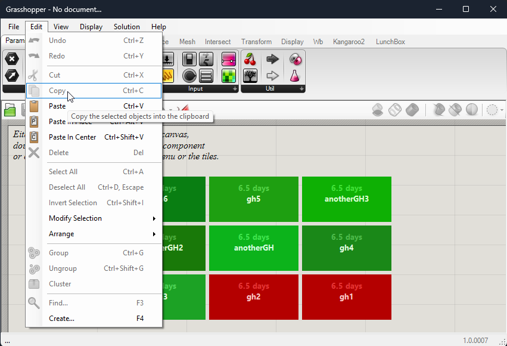{ width="850" }
    </figure>

    !!! Tip
        Most non-mac computers will be able to use the common shortcuts ++ctrl+c++ for copy, etc. Users with mac laptops *but running Rhino on Windows* often have to use the commands located in ```edit``` in order to copy, paste, delete.

    Grasshopper's ```copy```, ```paste```, ```delete```, ```undo```, ```redo```, ```select all```, and ```deselect all``` will function as expected. Most likely, you will end up using the shortcuts. For example, +++ctrl+c+++ for copy. We will get to what exactly we will be copying in the next section.

    The other commands will be covered in later sections.

=== "View tab"

    <figure markdown>
    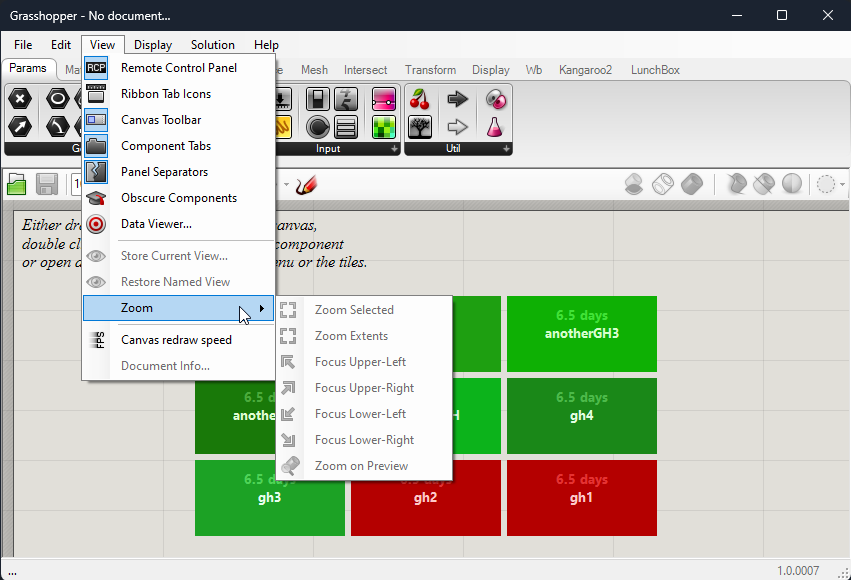{ width="850" }
    </figure>

    The view tab primarily deals with the view of the interface menus itself. Feel free to play around with settings, but know that these tutorials use default settings. 

    The one section that you may find useful is ```zoom```. This section allows you to zoom to different areas of your definition and the canvas.

=== "Display tab"

    <figure markdown>
    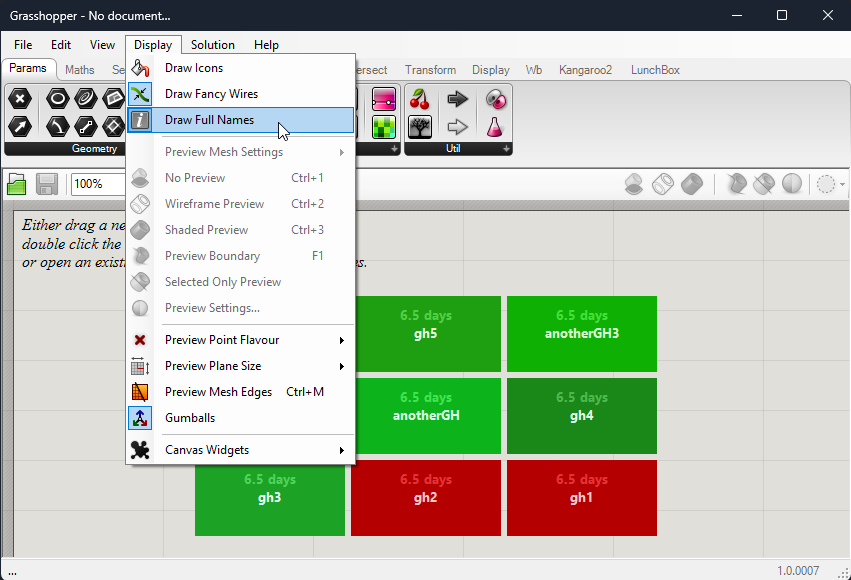{ width="850" }
    </figure>

    The display tab primarily deals with the was grasshopper objects are drawn in Rhino and the way Grasshopper components are drawn on the canvas.

    !!! Tip
        For all of these tutorials we will use the default display setting minus one change. I would encourage you to enable ```Draw Full Names```. This setting will render full names on your GH components. This is especially helpful for learning what each component does.
    
    Return to the settings after completing the **Grasshopper Basics** section. You may find that you prefer different display settings. For now, you can leave all other settings as default.

=== "Solution tab"

    <figure markdown>
    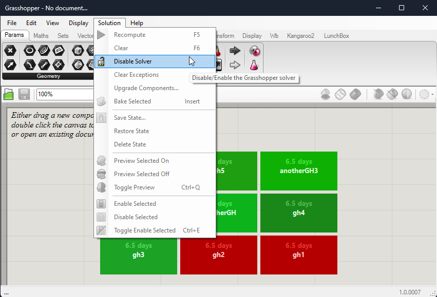{ width="850" }
    </figure>

    The solution tab primarily deals with the *Grasshopper solver*. As data flows through your components, you can use the options in this tab to pause the solver and save states of flows.

    This section also allows you to disable, preview, and bake (bring into Rhino) the outputs of components.

    You will find that this tab is rarely used, so know it's there, but don't be surprised if you never open it again.

=== "Help tab"

    <figure markdown>
    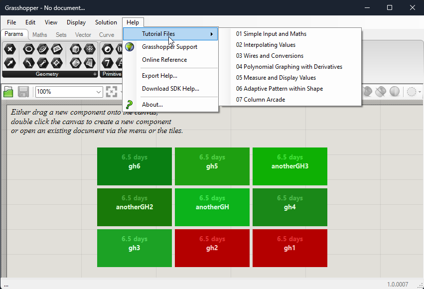{ width="850" }
    </figure>

    Now, this is an important tab!

    !!! diy "Try it for yourself!"
        While we're here. Take some time to go through the ```tutorial files```. Don't worry if they don't totally make sense.

    The ```grasshopper support``` command will take you to the [Mcneel Grasshopper Forum](https://discourse.mcneel.com/c/grasshopper/2). It's worth searching this forum for a question you may have. Further, make an account and ask you own question if you can't find an answer!

    The ```Online Reference``` command will take you to the [Grasshoper Components Documentation](http://grasshopperdocs.com/) where you will find notes *on every single component.*

    !!! Tip "Google is your friend"
        I would encourage you to simply google "grasshopper" plus whatever problem you are trying to solve. Google is your friend.

    !!! Tip "ChatGPT is your unreliable (but still useful) friend"
        You can also try asking [ChatGPT](https://chat.openai.com/) to describe a basic component flow and even generate a rudimentary diagram.

        Try phrasing you question as 
        
        ```I'm using Rhino 3D grasshopper. What components could I use to make a <insert your goal here>? Include a diagram with your answer.```

        You will get a step by step instruction set with a diagram that looks like this:
        ```
          [Curve]   [Curve Length]  [Divide Curve]   [Point On Curve]
             |             |                |                |
             +-------------+----------------+----------------+
                                   |
                             [Offset Curve]
                                   |
                                   +-------+
                                           |
                                        [Loft]
                                           |
                                           +------+
                                                   |
                                          [Sweep 1 Rail]
                                                   |
                                             [Staircase Geometry]
        ```
        Pretty cool!

        In my testing, its answer are *generally* correct in approach but will contain smaller errors. This may be a good way to brainstorm but do not use ChatGPT as a crutch, especially when you are first learning.

=== "File browser"

    <figure markdown>
    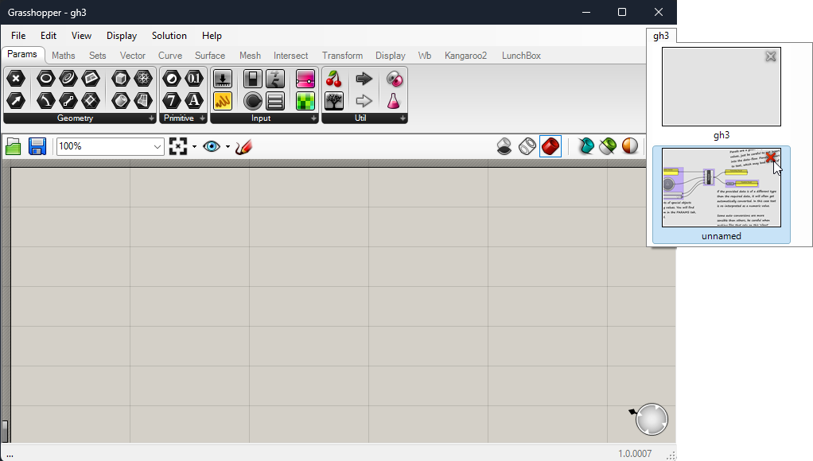{ width="850" }
    </figure>

    The ```file browser``` appears after you have opened at least one GH file. When you have more than one GH file open, you can switch between them using the ```File browser``` located on the right hand side of the main menu bar. You can also close files from the browser.


## Components Panel
=== "Intro"

    <figure markdown>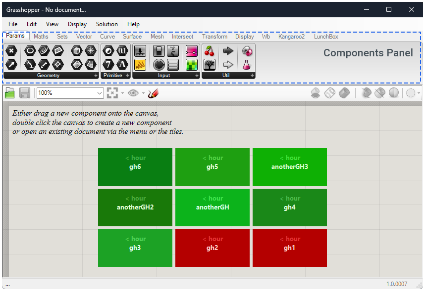{ width="850" }</figure>

    Welcome to the component panel, where you can explore all the different component categories. Each component belongs to a specific category, such as "Params" for primitive data types or "Curves" for curve-related tools.

=== "Using the Components Panel"

    <figure markdown>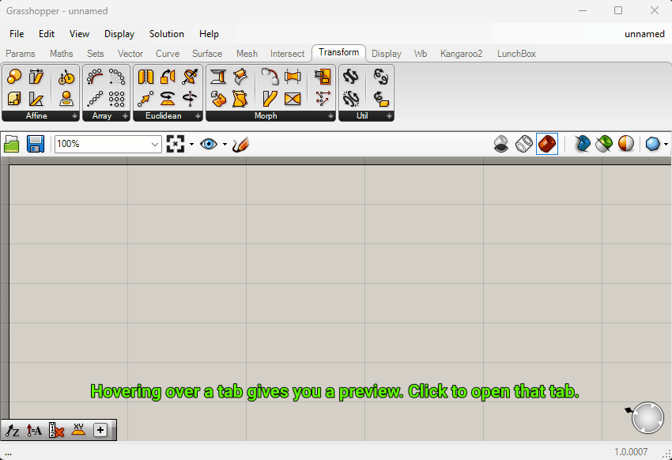{ width="850" }</figure>

    Each category of components is given its own panel. To switch between categories, you click the tabs on the top of the panel. For example, clicking the ‘vector’ tab will display all vector components and clicking the ‘curve’ tab will display all curve related components. Within each of these categories you will see that the components are grouped into sub-categories that further organize components.

    Since there can be a large number of components per sub-category, we only display the most commonly used ones in the main panel. If you want to see the entire collection, simply click on the dark grey bar with the little arrow at the bottom of the panel. When you click on the bar, a category panel will pop up, giving you access to all the objects. In this panel, you have two options: you can either click on the objects in the popup list, or you can directly drag them from the list onto the canvas. Personally, I prefer the click method as the drag method sometime creates two of the same components!

    Clicking on buttons will not automatically add them to the canvas. To add a component to your canvas, you must click once on the component icon, and then once again on the canvas itself.

    You can find where a component lives in the panel by holding ++ctrl+alt++ on your keyboard and hold clicking on a canvas component. This command will circle and arrow the exact location of the component!

    You can also double click an empty portion of the canvas to search for a component by name.

    !!! Tip "Hover over everything!"
        You can hover over components in the panel, the search bar, and on the canvas to display a text description of what said component does. Do this often, especially while you are learning!

=== "Params"

    <figure markdown>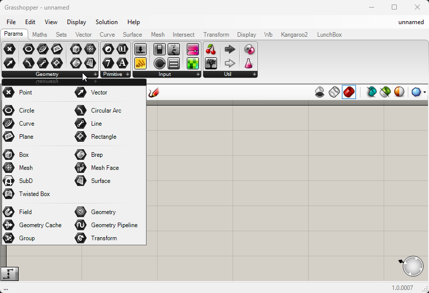{ width="850" }</figure>

    This panel houses all the primitive data types, such as numbers, texts, and boolean values. You can use these components to input or generate data for your designs.

=== "Maths"

    <figure markdown>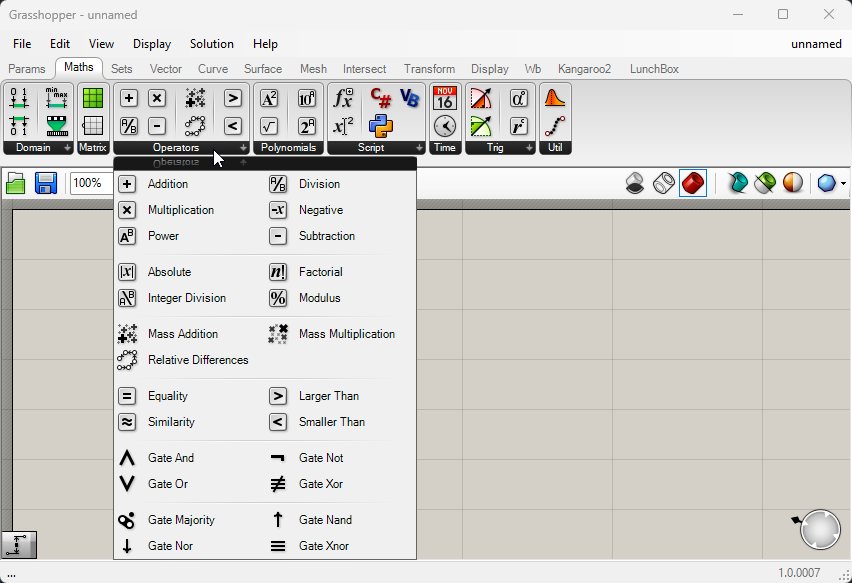{ width="850" }</figure>

    If you need to perform mathematical operations within Grasshopper, the Math panel is where you'll find the relevant components. It includes components for basic arithmetic, trigonometry, logarithms, and more.

=== "Sets"

    <figure markdown>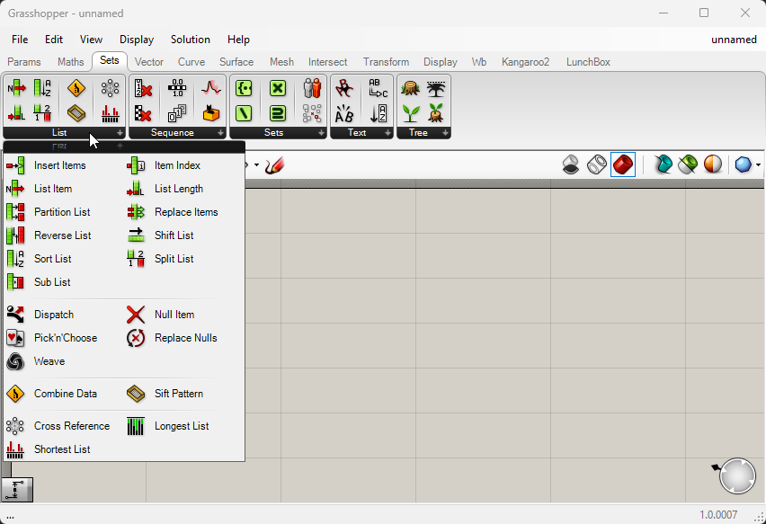{ width="850" }</figure>

    In the Sets panel, you'll find components for working with sets and lists of data. You will primarily use the *list* sub-category to organize your Grasshopper data. More advanced components allow you to perform set operations on the data itself, such as union, intersection, difference, and more.

=== "Vector"

    <figure markdown>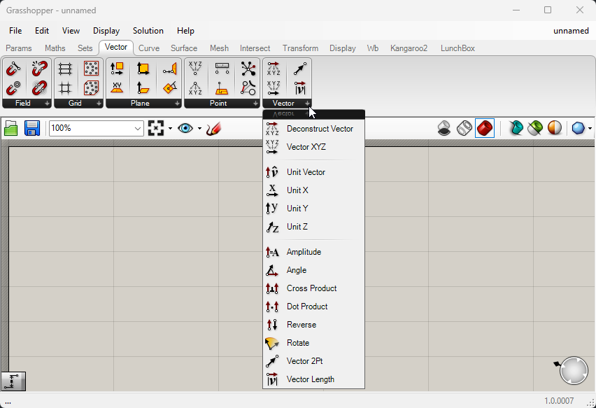{ width="850" }</figure>

    The Vector panel is where you'll find components related to vector operations. Vectors represent direction and magnitude, and they are fundamental in many design and computational geometry tasks. This panel provides components for creating, manipulating, and analyzing vectors within Grasshopper.

    In addition to vectors, you will also find commands related to planes and points. Planes will allow you to orient geometry while points will allow you to define specific locations in space.

    The Vector panel is particularly useful when working with geometric transformations, such as translating or orienting objects in space. You can use the components in this panel to define and manipulate vectors, planes, and points that control the direction and magnitude of these transformations.

=== "Curve"

    <figure markdown>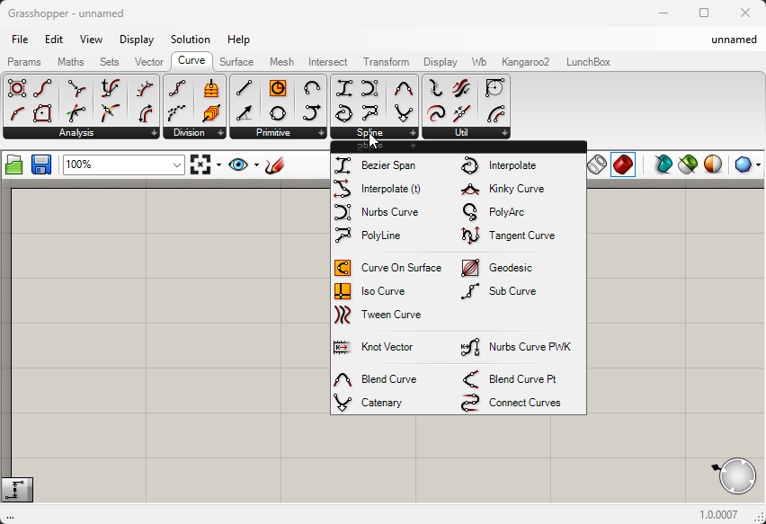{ width="850" }</figure>

    In the Curves panel, you'll find a variety of tools and components related to curves. This includes components for creating, manipulating, and analyzing curves in your Grasshopper projects.

=== "Surface"

    <figure markdown>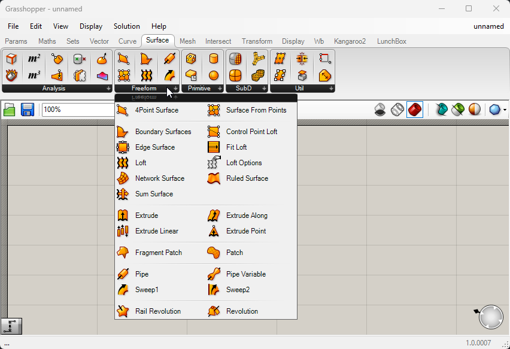{ width="850" }</figure>

    The Surfaces panel provides components for working with surfaces. You can create, modify, and analyze surfaces using the tools available in this panel.

=== "Mesh"

    <figure markdown>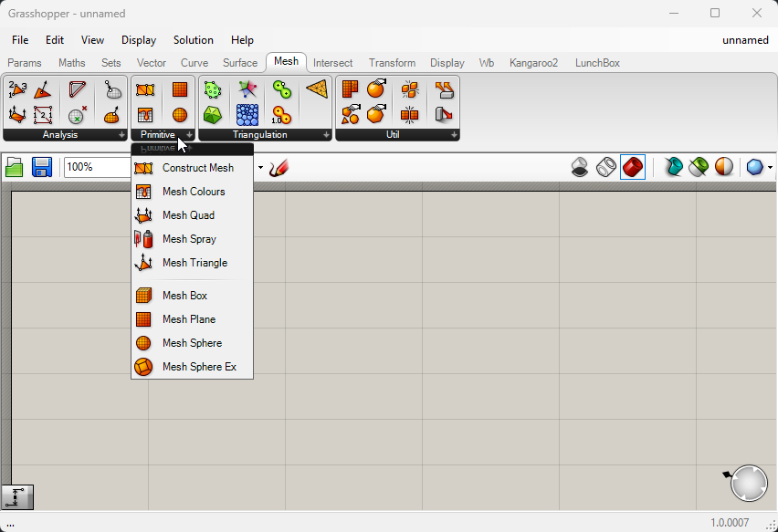{ width="850" }</figure>

    If you're working with 3D meshes, the Mesh panel is where you'll find the necessary components. It offers tools for creating, editing, and analyzing meshes in Grasshopper

=== "Intersect"

    <figure markdown>{ width="850" }</figure>

    The Intersect panel in Grasshopper houses components for finding intersections between geometric entities. It includes tools to identify points, curves, surfaces, and other objects where they intersect or overlap. These components are vital for geometry analysis, spatial relationships, and generating complex shapes.

=== "Transform"

    <figure markdown>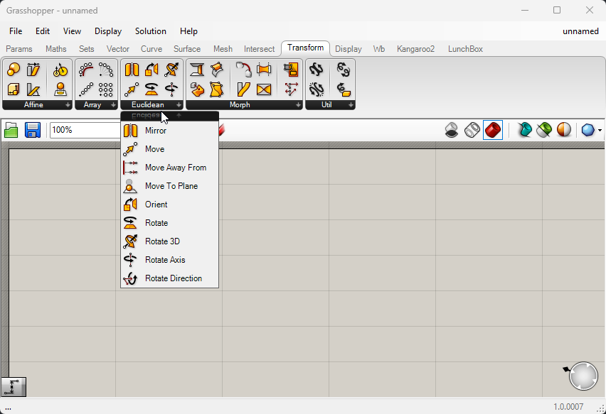{ width="850" }</figure>

    The Transform panel contains components for transforming geometry in various ways. This includes translation, rotation, scaling, and other transformations that allow you to manipulate objects in your Grasshopper projects.

=== "Display"

    <figure markdown>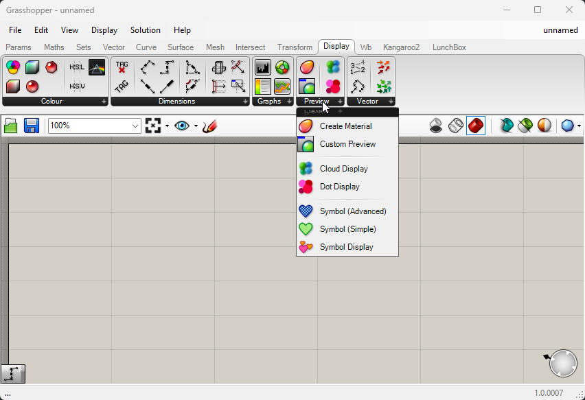{ width="850" }</figure>

    The Display panel offers components for visualizing your data and designs. It includes components for creating 2D and 3D graphics, controlling colors, and setting up visualization parameters.

=== "Kangaroo2"

    <figure markdown>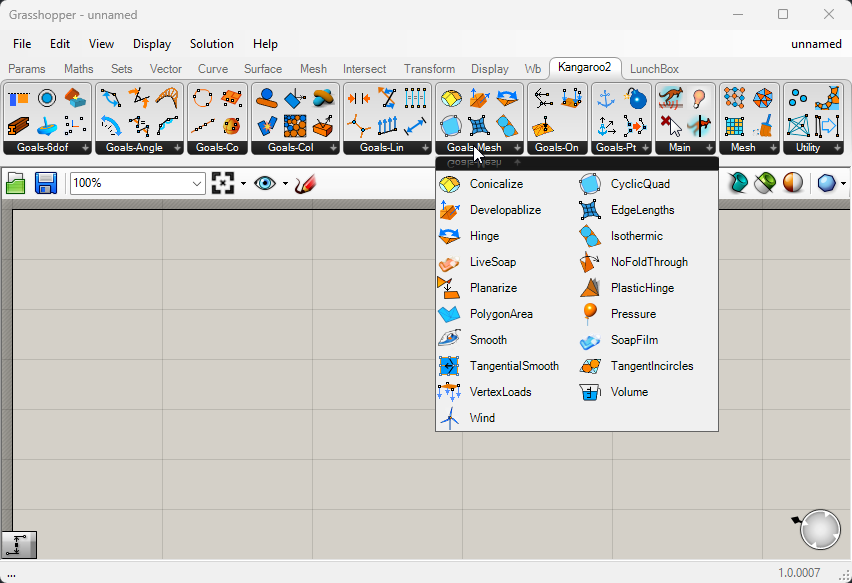{ width="850" }</figure>

    The Kangaroo panel in Grasshopper is dedicated to the Kangaroo physics engine, a powerful tool for simulating and modeling physical behavior within your designs. This panel contains components that enable you to apply constraints and forces to your geometry, allowing you to simulate structural, mechanical, and natural systems.

    By utilizing the Kangaroo panel's components, you can add realistic physics-based behavior to your designs, enabling you to explore and analyze how objects interact, deform, and respond to external forces. The Kangaroo panel opens up a world of possibilities for creating interactive and dynamic designs in Grasshopper.

## The Canvas

=== "Intro"

    <figure markdown>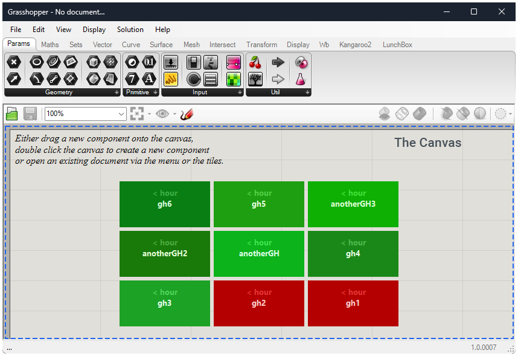{ width="850" }</figure>

    Welcome to the Grasshopper canvas! The canvas is where your creative ideas come to life and where you bring your designs to reality. It serves as the digital workspace where you connect components, define relationships, and build intricate visual algorithms.

=== "Working in the canvas"

    <div class="video-wrapper">
    <iframe width="1280" height="720" src="https://www.youtube.com/embed/Vi0KUg2G1Mk" frameborder="0" allowfullscreen></iframe>
    </div>

    The canvas is where we build our definitions. Rather than breaking down each command into text, we opted for a video explanation. Watch the video - pause often - try to follow along on your own computer. 

=== "Canvas Widgets"

    <figure markdown>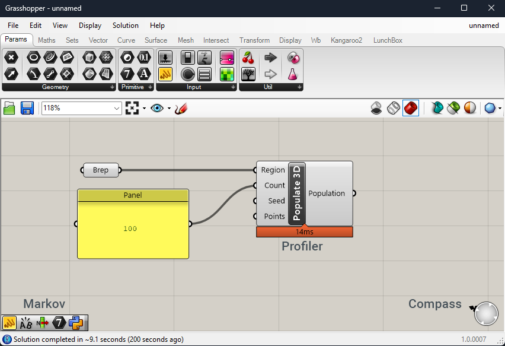{ width="850" }</figure>

    The Grasshopper canvas provides a few widgets to enhance our workflow.

    *Markov* tries to guess what component we will want to use next. Simply click the icon to place the indicated component on the canvas. It makes better predictions as you work more in Grasshopper. Useful? Maybe!

    *Compass* orients you towards the components on your canvas. This can actually be quite useful if you are lost way out in outer extremities of the canvas.

    *Profiler*. By default this widget will not show. To enable it go to ```Display -> Canvas widgets -> profiler```. This will attach a little indicator to most components indicating the time it takes the Grasshopper solver to compute the work said component is performing. This widget can be helpful to troubleshoot problem areas in your definition. Further, if you write your own components in Python or C#, the profiler also provides valuable feedback on the components performance.


