# Interacting with Rhino and Basic Geometrical Concepts

See [this Rhino file](https://github.com/aarcThom/aarc-wiki/blob/main/gh_definitions/02_refRhino_geoConcepts.3dm) and [this Grasshopper file](https://github.com/aarcThom/aarc-wiki/blob/main/gh_definitions/02_refRhino_geoConcepts.gh).

In this example, we will be looking at how we can place a tree, made with Rhino, on a surface, lofted in Grasshopper from Rhino curves. We will explore the the following important concepts:

1.  **Referencing Rhino geometry**
2.  **Surface UVs**
3.  **Points**
4.  **Vectors**
5.  **Planes**

Our grasshopper definition looks like this:

<figure markdown>
  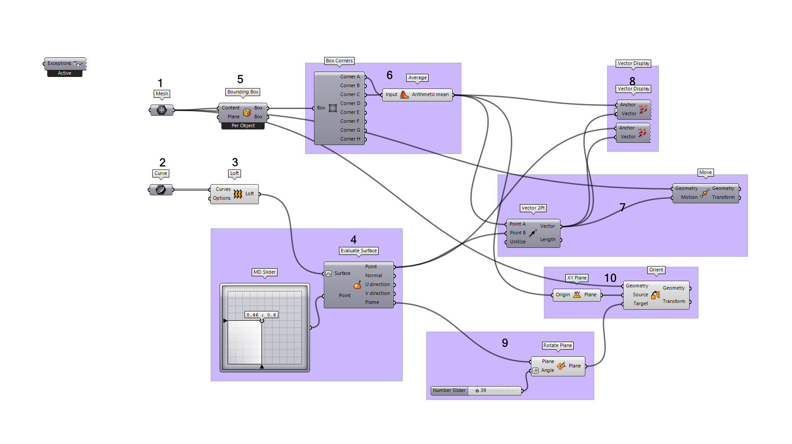{ width="850" }
</figure>

Our Rhino viewport will look like this:

<figure markdown>
  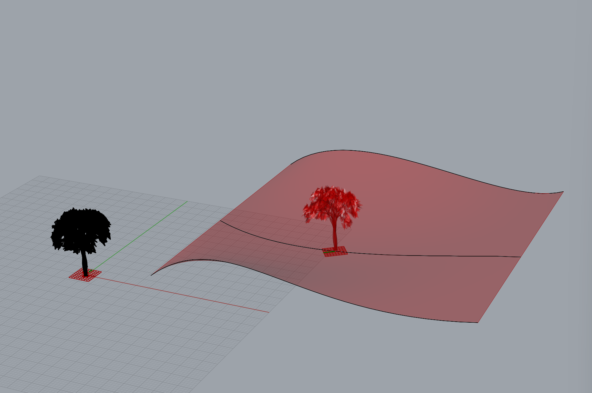{ width="850" }
</figure>

## 01 / 02 - Referencing Rhino Geometry

For the last definition we looked at, we created all of our geometry within Grasshopper itself, but usually it's easier to create geometry in Rhino and then bring it into Grasshopper. This is called **referencing geometry**.

For an in-depth look at referencing Rhino geometry, see [this thorough write-up on Hopific](https://hopific.com/how-to-reference-objects-in-grasshopper/#:~:text=Referencing%20geometry%20is%20oftentimes%20the,first%20group%20called%20'Geometry'.).

## 03 - Interacting with Rhino Geometry

When you reference Rhino geometry in Grasshopper, you are creating a live link to that geometry. Changes that are made in Rhino will automatically update the referenced geometry in Grasshopper. Any downstream impacts within the GH definition will also update in real time.

In our case, after referencing our curves, we can move them around, scale them, adjust their control points, etc. and all changes will be reflected in Grasshopper.

<figure markdown>
  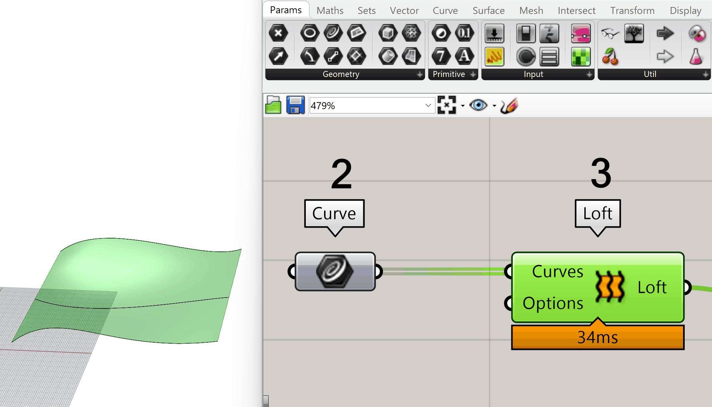{ width="850" }
</figure>

However, there are limitations to this live link. Grasshopper references geometry per Rhino object. If you were to split one of your referenced curves into two, Grasshopper would lose the link to the two resultant curves, as technically, two new objects are created in Rhino. In such a case, you will need to re-reference the new geometry.

<figure markdown>
  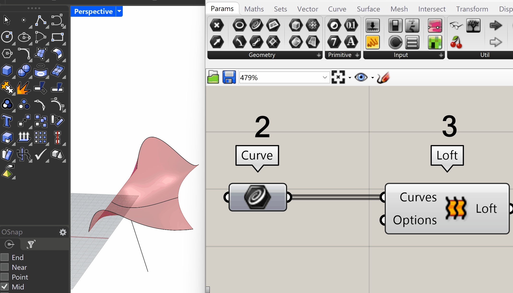{ width="850" }
</figure>

## 04 - Surface UV Coordinates

### UV Coordinates - Overview

In Rhino, we are used to working with coordinates. In particular, we are used to working in a 3D Cartesian coordinate system composed of X values and Y values (the horizontal coordinates) and a Z value (the vertical coordinate). If we wanted to represent some points on our lofted surface as X,Y,Z coordinates, it would look something like:

<figure markdown>
  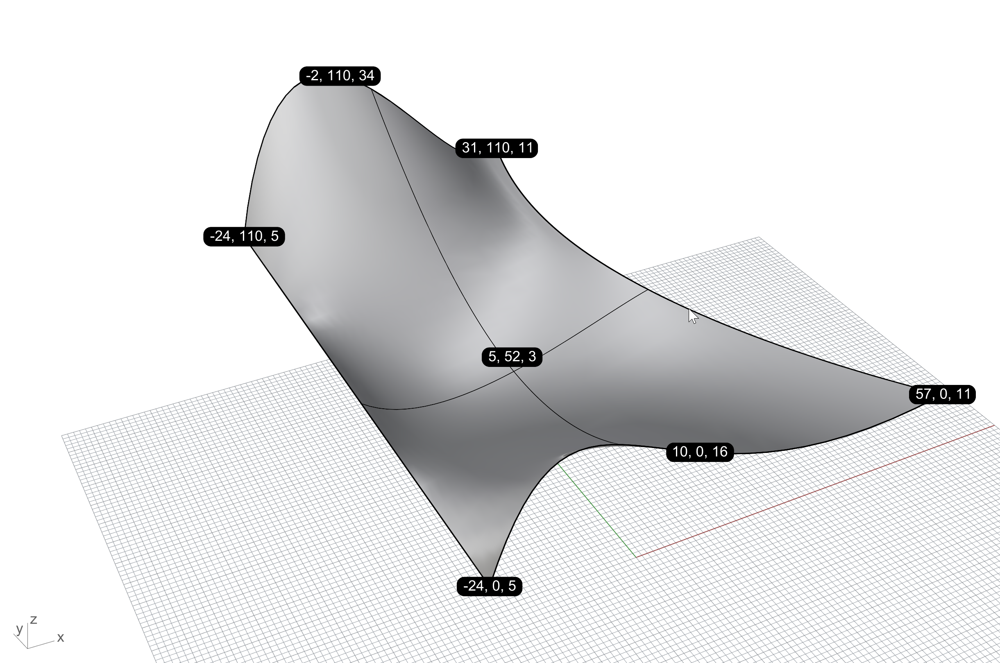{ width="850" }
</figure>

This X,Y,Z coordinate system is great for a lot of things, but gets a bit clunky when we want to describe a position on the surface itself. For example, the above image shows our center point of the surface as **(28, 148, 14)** but wouldn't it be much easier if we could describe our center point as **(0.5, 0.5)**? This is where a **UV coordinate system** comes into play. We can describe points on the surface with a **UV coordinate system** like so:

<figure markdown>
  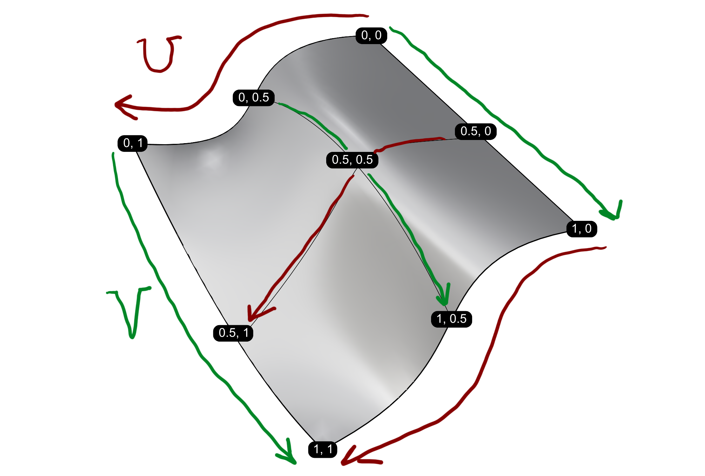{ width="850" }
</figure>

Since we are only working with U and V dimensions, we drop any notion of elevation. In other words, this coordinate system does not describe the waviness of the surface but only the position *within* the surface. If you want to form a mental image, imagine a gridded blanket where you consider the lines in one direction U, and the lines in the other direction, V. Those lines still describe the same positions on the blanket, even if they're wrapped around a dog!

<figure markdown>
  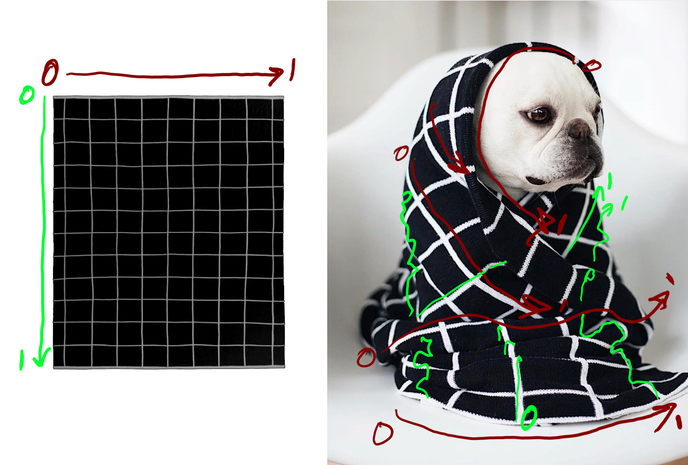{ width="850" }
</figure>

If you want to see those wavy lines in the Rhino screen, you can also run the command, `_ExtractIsocurve`.

<figure markdown>
  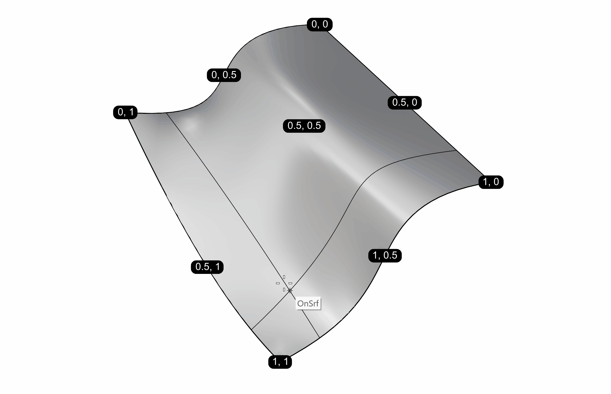{ width="850" }
</figure>

### UV Coordinates - Reparameterization

In Grasshopper it is really useful to describe surfaces with UV coordinates ranging from 0 to 1 in both directions. It ensures that whatever wavy surface we pass into a component, we will be able to describe a location on that surface.

If we look back to [the provided file's group 4](https://github.com/aarcThom/aarc-wiki/blob/main/gh_definitions/02_refRhino_geoConcepts.gh) you can see that we're using the `MD Slider` to define a UV coordinate which we feed into the **Point** input of `Evaluate Surface`.

<figure markdown>
  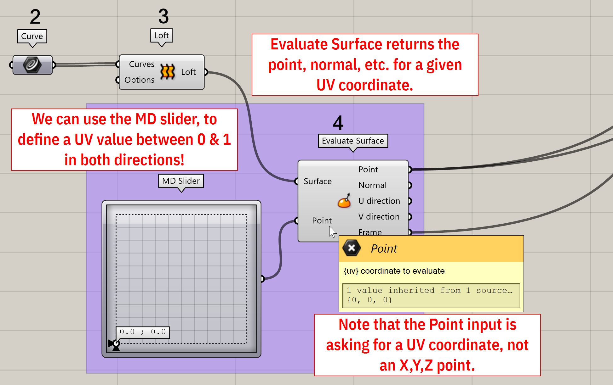{ width="850" }
</figure>

This makes sense so far given what we've learned about UV coordinates, but why do we only see a little wiggle when we move the `MD Slider` around? We see this behavior because Grasshopper, by default doesn't assign a range of 0 --> 1 to the UV directions of a surface. The UV values by default are based on XYZ values, or something like that, I think ... I've represented these random upper limits of UV with 1234 in the image below. In other words, it doesn't really matter what your initial UV system is, because you always want good old predictable 0 to 1! 

<figure markdown>
  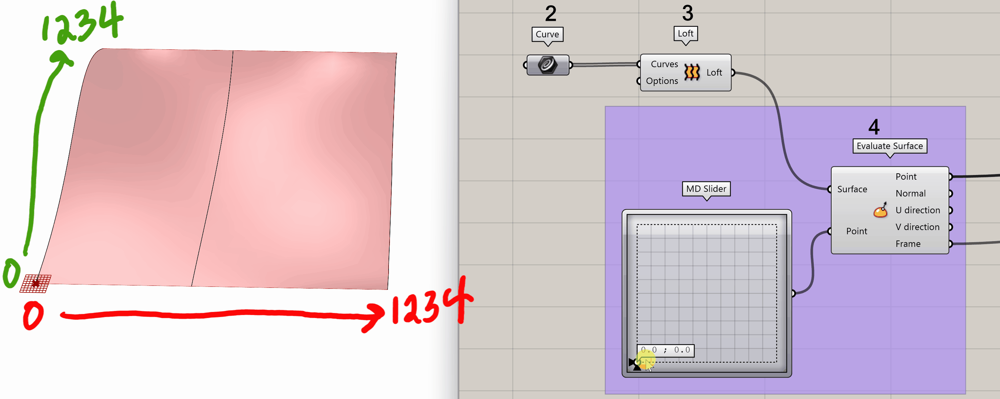{ width="850" }
</figure>

To convert our surface's UV ranges to 0 --> 1, we have to ++"rmb"++ the **Surface** input of `Evaluate Surface` and click *Reparameterize*. You will know see that UV coordinates output by `MD Slider` return the location on the surface that we would expect. Get used to *reparameterizing* surfaces all the time in Grasshopper!

<figure markdown>
  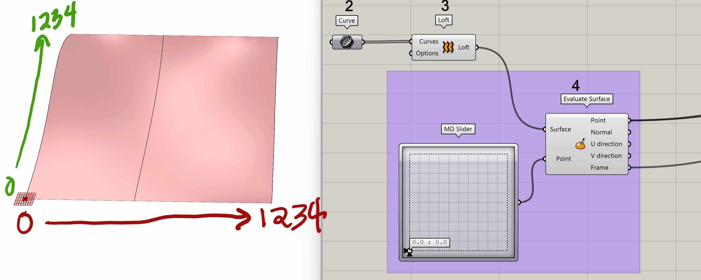{ width="850" }
</figure>

## 05 - Bounding Boxes
A **Bounding Box** is a plane-aligned box (a rectangular prism) that exactly contains the extents of a geometry. For example, in 2D, a bounding square would exactly describe the complex bounds of the below geometry like so:

<figure markdown>
  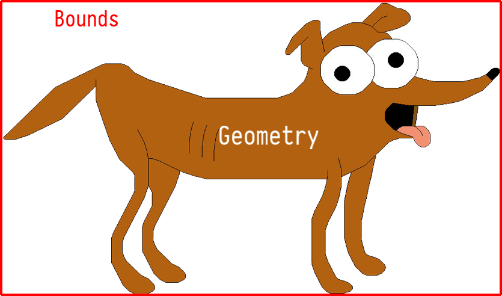{ width="850" }
</figure>

A bounding box extends this behavior to all 3 dimensions. 

<figure markdown>
  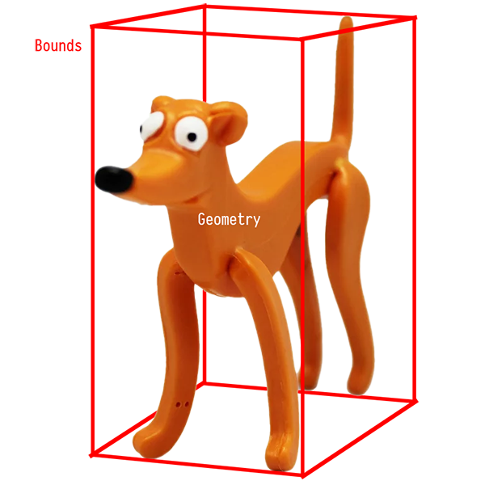{ width="850" }
</figure>

Bounding boxes are useful for getting general dimensions of an object, or getting generalized points, among other things. In this case we are going to grab two points for from the corners of a bounding box in order to find the middle base point.

## 06 - Points
**Points** represent a position in space. We've already encountered the concept of UV point where a point has a U value (0-->1) and a V value (0-->1), but in this section we will look at 3 dimensional points. The 3D point is the type of point you will most commonly encounter in day-to-day practice.

In step 6 of the example GH definition, we are first grabbing all the corners of the tree's `Bounding Box` with `Box Corners`. If we hover over the outputs of **Corner A** and **Corner B**, we will see that they return two points on the bottom of the box.

<figure markdown>
  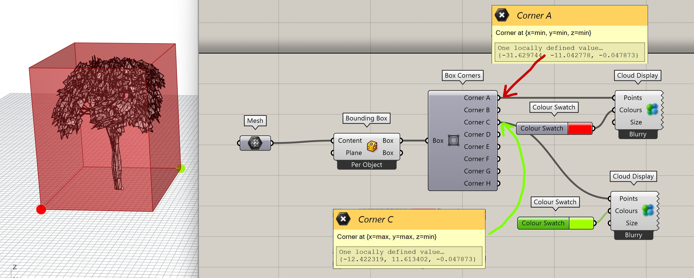{ width="850" }
</figure>

As we mentioned, 3D points have three dimensions: X, Y, and Z. The outputs A and B give us the point at X=Min, Y=Min, Z=Min and X=Max, Y=Max, and Z=Min respectively. This is how we know that the points are diagonal to each other. We can also hover over the ouputs and see the actual Rhino space coordinates of each point.

Since points are defined by 3 coordinates each, we can perform a bit of math on them to compose new points. In the second part of step 6, we use `Average` to find the point in between the two corner points.

<figure markdown>
  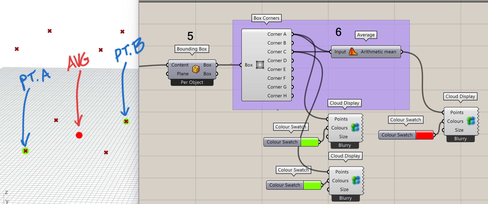{ width="850" }
</figure>

This works because we are averaging each coordinate. For example, two points $[0,0,0]$ & $[1,1,0]$ would give us $[(0+1)/2,(0+1)/2,(0+0)/2] = [0.5,0.5,0]$

<figure markdown>
  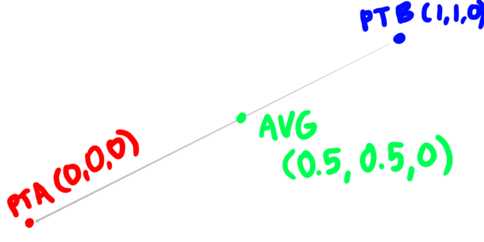{ width="850" }
</figure>

Points are closely related to, but not the same as, the next topic, **Vectors**.

## 7 / 8 - Vectors
A **Vector**'s textual representation *looks* like a point. In other words, $[1,1,1]$ could represent both a point and a vector.

However vectors are very different! Whereas a point describes a coordinate in 3 dimensional space, and in Rhino, is also a geometric object, a vector describes a *direction and length* in 3 dimensional space. A vector can be thought of as a *translation* or a movement.

Below shows points at $[0,0,0]$ and $[1,1,1]$ and a vector, $[1,1,1]$. Since a vector describes a *translation*, and is not actually a piece of geometry, the arrow is just a visual representation of the vector. In this case, we could say that a vector $[1,1,1]$ translates a point at $[0,0,0]$ to a new coordinate at $[1,1,1]$.

<figure markdown>
  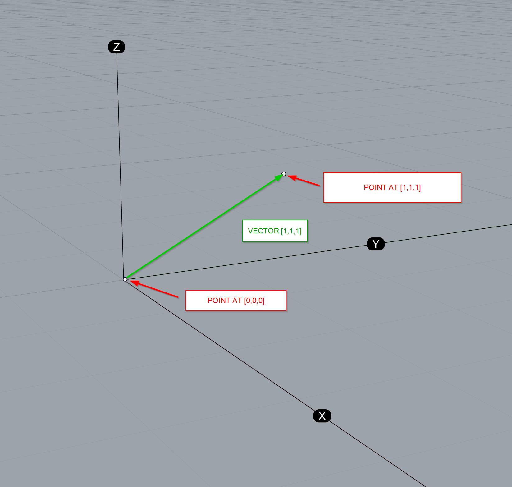{ width="850" }
</figure>

A vector is not tied to a specific location, like a point is. The same vector $[1,1,1]$ could also be used to translate a point from the coordinate $[1,1,1]$ to the coordinate $[2,2,2]$. 

<figure markdown>
  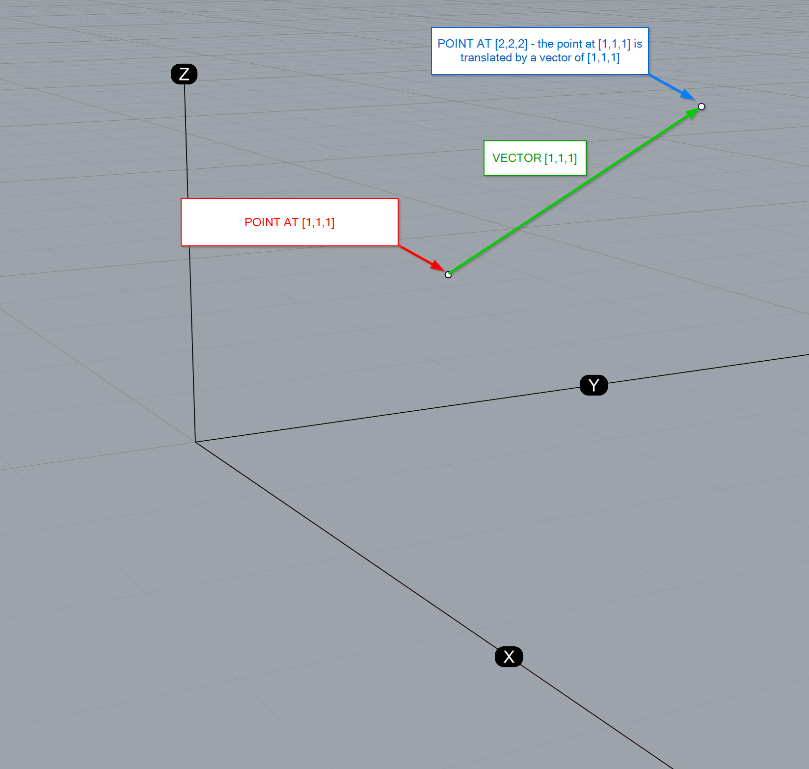{ width="850" }
</figure>

Remember, the vector arrows drawn are just visualizations of a vector - a vector does not need a start or end point. An analogy: you can tell someone to walk forward 10 steps and to the right 5 steps in either Paris or Hong Kong - the directions you give are still the same regardless of where the person starts or ends.

See [this Hopify article](https://hopific.com/vectors-in-grasshopper/)

## 9 / 10 - Planes
See [this Hopify article](https://hopific.com/construction-planes-in-grasshopper/)
